# Agent Studio 问题与优化需求

本文整理当前功能、界面与交互中的问题，以及期望的调整方向。以下内容为待处理需求，不代表已经实现。

## 一、功能问题

### 1.1 新建项目时的提示

**期望调整：** 明确新建项目时相关提示的用途，并考虑是否可以省略。

### 1.2 “完全访问”应保持为全局状态

**期望调整：** 选择“完全访问”后，应全局保持该状态，而不是仅对单个对话生效。

### 1.3 开启“完全访问”后，对话标签异常

**当前问题：** 新建对话并选择“完全访问”后，当前对话的标签变成了 `/always-approve`。

**期望调整：** 对话标签应正常展示，不应被权限指令替换。

### 1.4 插件页面无法找到自行安装的插件

**当前问题：** 自行安装的插件在插件页面中不可见，无法找到对应入口。

**期望调整：** 在插件页面清晰展示已安装的插件。

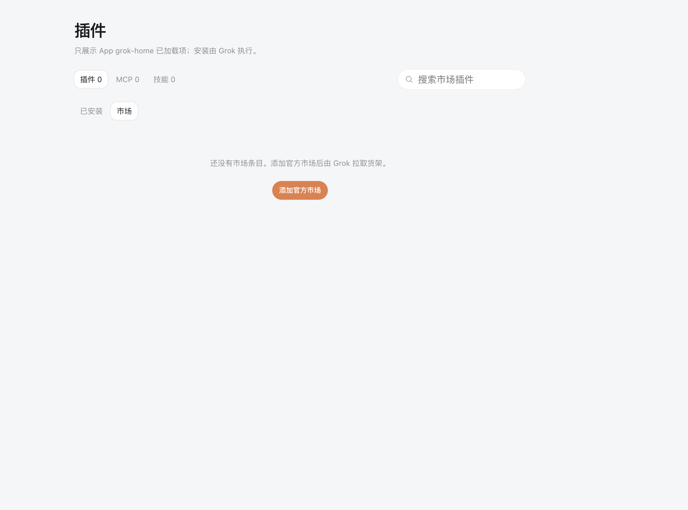

### 1.5 支持无项目聊天

**当前问题：** 开启对话需要先添加项目。

**期望调整：** 参考 Codex，允许在没有项目的情况下直接开始聊天。

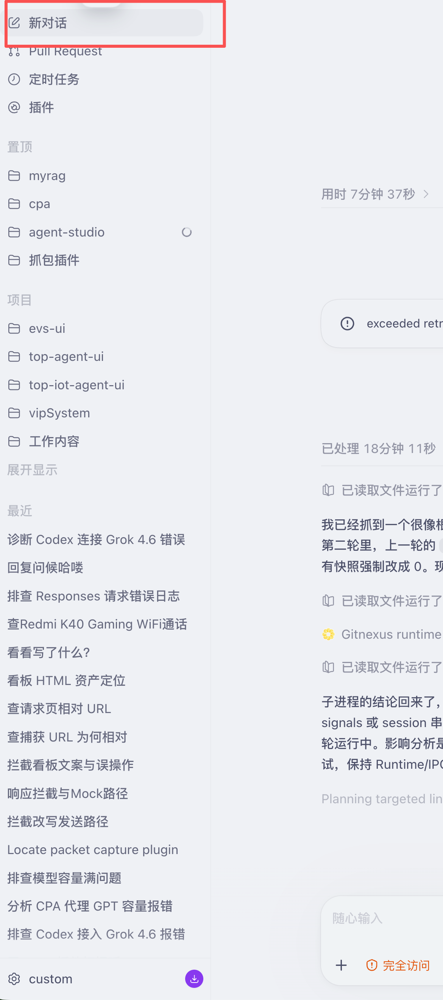

### 1.6 对话过程中支持继续发送消息

**期望调整：** 参考 Codex，在当前对话进行过程中，允许继续发送消息。

### 1.7 文件变更展示过于突出，且持续悬浮在底部

**当前问题：**

- 文件修改信息过于突出，影响对话界面的观感。
- 相关内容一直悬浮在底部，后续对话出现时仍未正常上移。

**期望调整：** 优化文件变更信息的视觉层级和展示位置，使其与对话内容自然衔接。

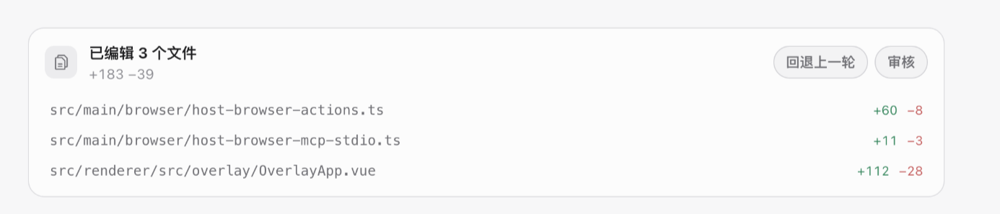

## 二、UI 与交互问题

当前界面的视觉表现与交互体验都需要整体改善，具体问题如下。

### 2.1 输入区域的 Token 用量展示

**期望调整：** 参考 Codex，用小圆环展示 Token 用量；鼠标悬停在圆环上时，再展示详细用量信息。

**当前界面：**

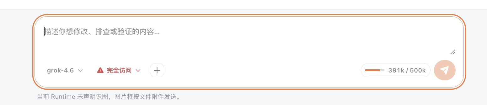

**参考效果：**

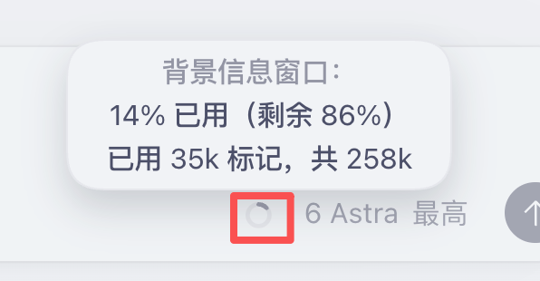

### 2.2 批准操作与模型选择列表

**当前问题：** 批准操作和模型选择列表的视觉效果较差。

**期望调整：** 优化这两处控件的样式、布局与交互体验。

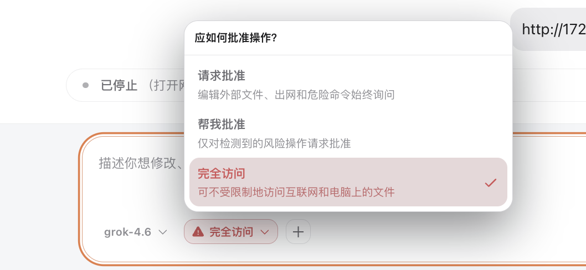

### 2.3 模型对话窗口

**当前问题：** 对话窗口的整体视觉效果不理想。

**期望调整：** 参考 Codex 的对话面板，重新优化布局与样式。

**当前界面：**

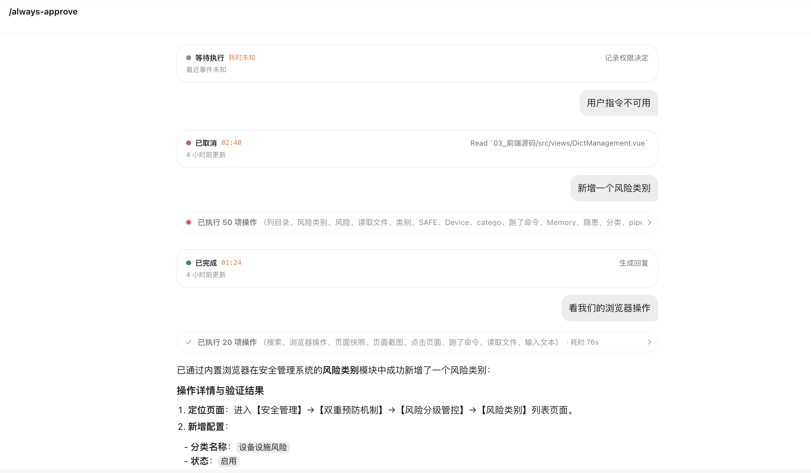

**参考效果：**

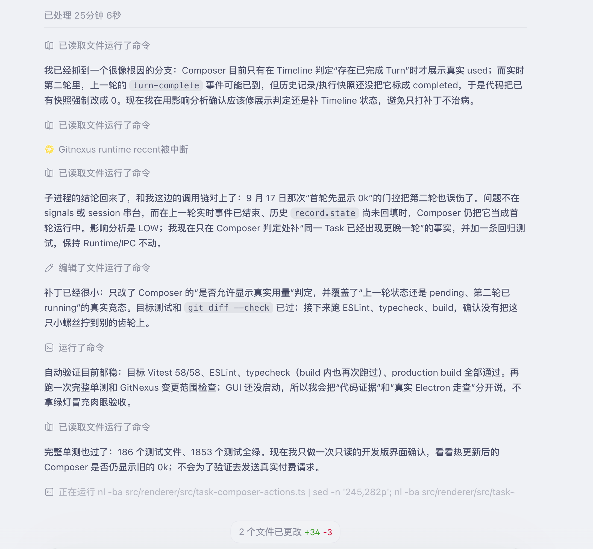

### 2.4 侧边栏与对话的联动

**当前问题：** 侧边栏原本计划与对话联动，但目前没有发挥作用，界面样式也需要改善。

**期望调整：** 重构侧边栏的交互逻辑与 UI，建立与对话的有效联动，可参考 Claude 和 Codex 的设计。

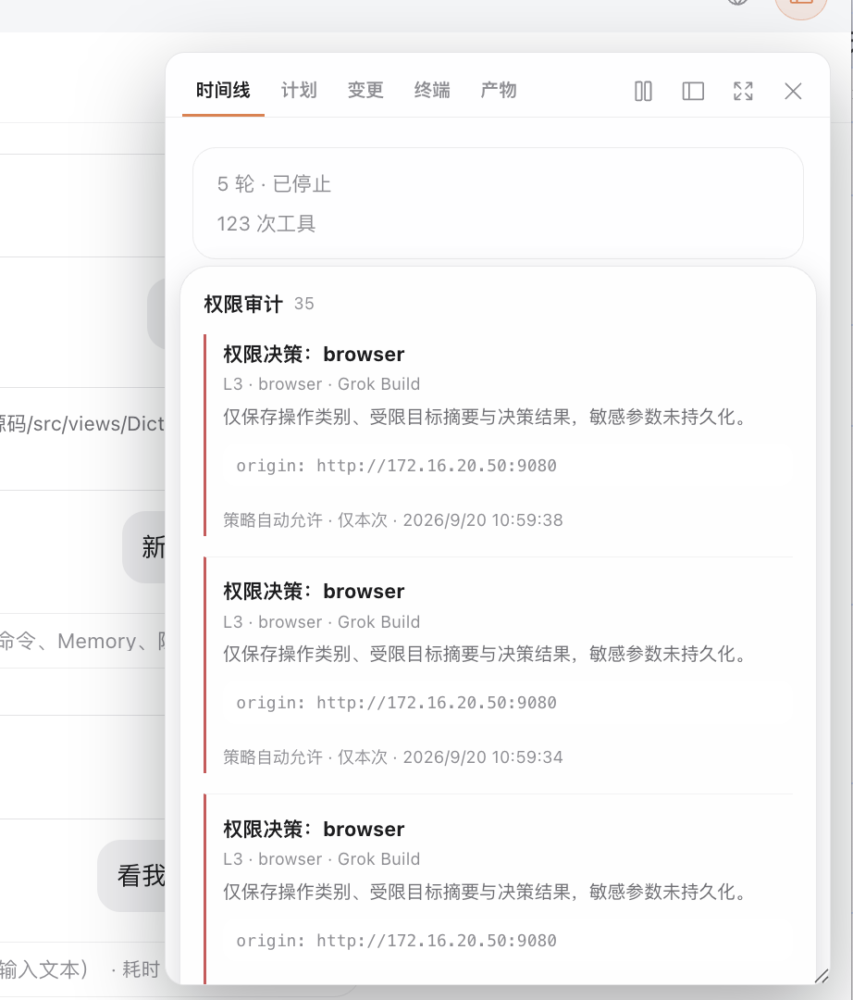

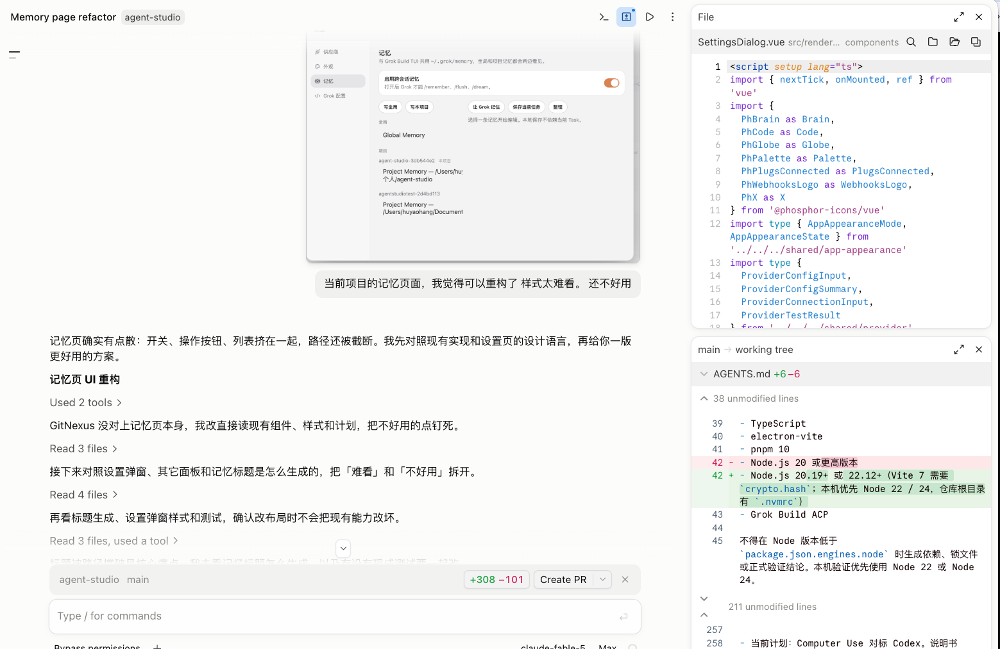

### 2.5 浏览器与对话窗口的布局切换

**当前问题：** 移动浏览器窗口后，对话区域的可用性受到影响，甚至难以找到发送入口。

**期望调整：**

1. 浏览器窗口移动到一定距离后，占满当前工作区域。
2. 对话框切换为悬浮工具形态，参考 Codex 的交互方式。
3. 点击顶部入口，可以查看当前正在执行的内容。

**当前界面：**

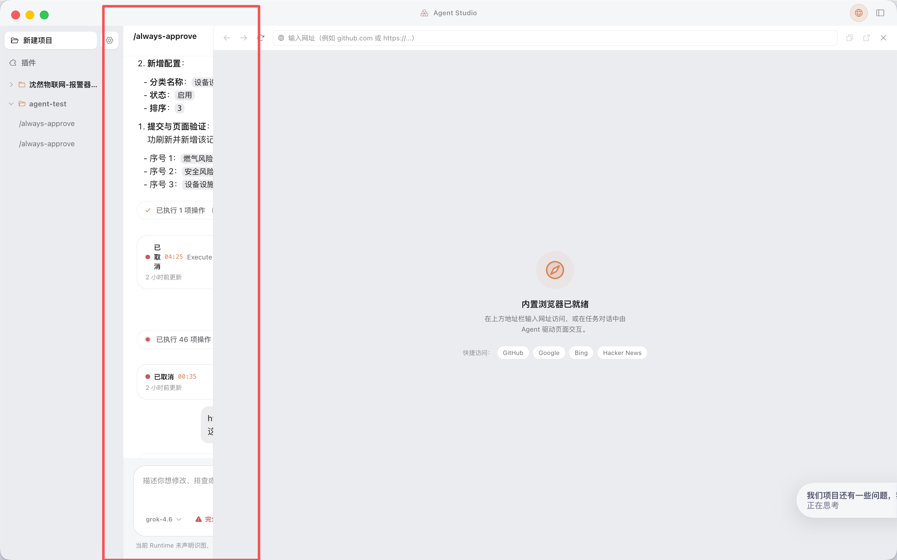

**参考效果：**

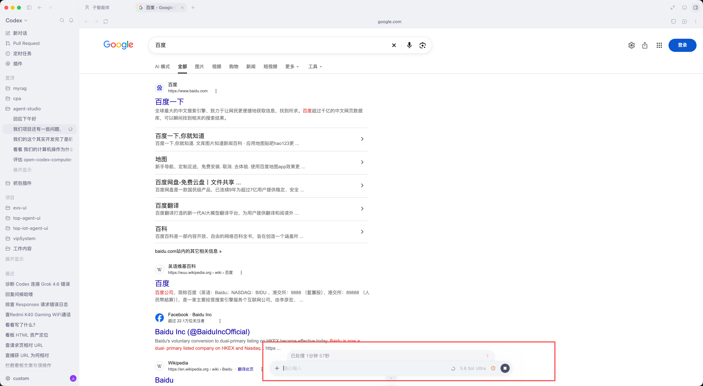

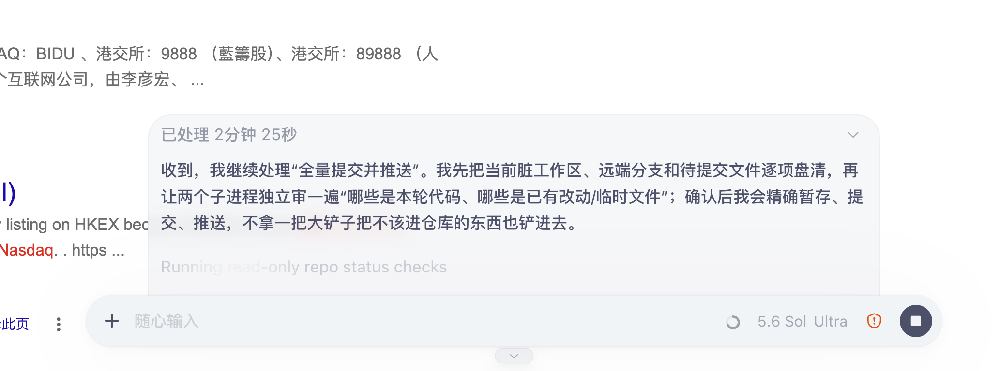

### 2.6 设置页面的功能呈现与布局

**当前问题：** 设置页面中各项功能的呈现方式和整体布局都不理想。

**期望调整：** 全面优化设置页面的样式、布局与操作体验。

### 2.7 重构当前项目的样式和交互逻辑（新增）

**期望调整：** 对当前项目进行整体样式与交互逻辑重构，统一各页面的视觉风格、布局和操作流程，改善整体使用体验。

## 三、重要产品定位

> **Agent Studio 的 Agent 应是通用、开放的 Agent，最终目标是代替用户的双手，操作电脑上的各种应用与功能。**
>
> 不应通过各种安全手段限制项目的通用性与开放性。
